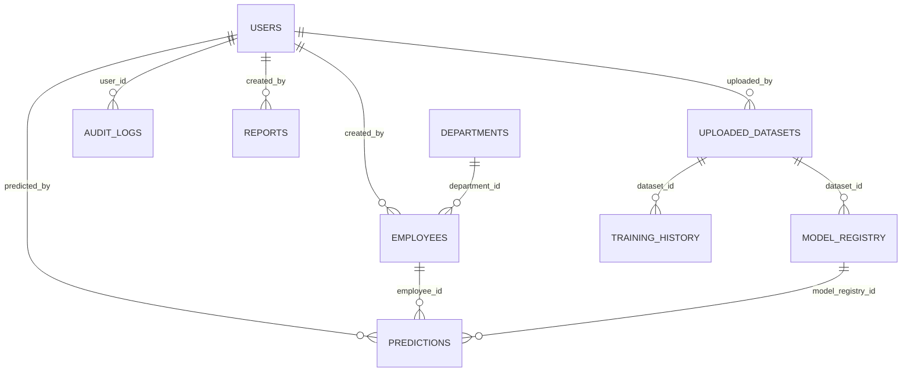

# AttritionIQ Entity-Relationship (ER) Diagram

## Entity Table Summary
- **USERS**: System user accounts (role-based access)
- **DEPARTMENTS**: Company organizational units
- **EMPLOYEES**: Employee master records (demographics, job features, status)
- **UPLOADED_DATASETS**: File upload metadata & checksum deduplication
- **MODEL_REGISTRY**: Champion and archived model versions & metrics
- **PREDICTIONS**: Individual predictions, risk levels, and SHAP factors
- **TRAINING_HISTORY**: Log of ML background training runs
- **AUDIT_LOGS**: Security audit trail
- **REPORTS**: Generated multi-format reports
